# AI Data Platform Johannesburg IoT Gift

This repository is dedicated to creating a starting point for your new and shiny Rapsberry Pi Pico using Azure IoT via Azure IoT Central.  

Start with the <b>Getting Started</b> page for the Pico provided by the <b>Raspberry Pi Foundation</b>  [Pico](https://projects.raspberrypi.org/en/projects/getting-started-with-the-pico)

Follow the <b>Getting Started</b> page for Azure IoT Contral provided by <b>Microsoft</b>  [IoT Central](https://learn.microsoft.com/en-us/azure/iot-central/core/howto-create-iot-central-application?tabs=azure-portal
)  

Create a new Device Template by clicking on the <b>New</b> button

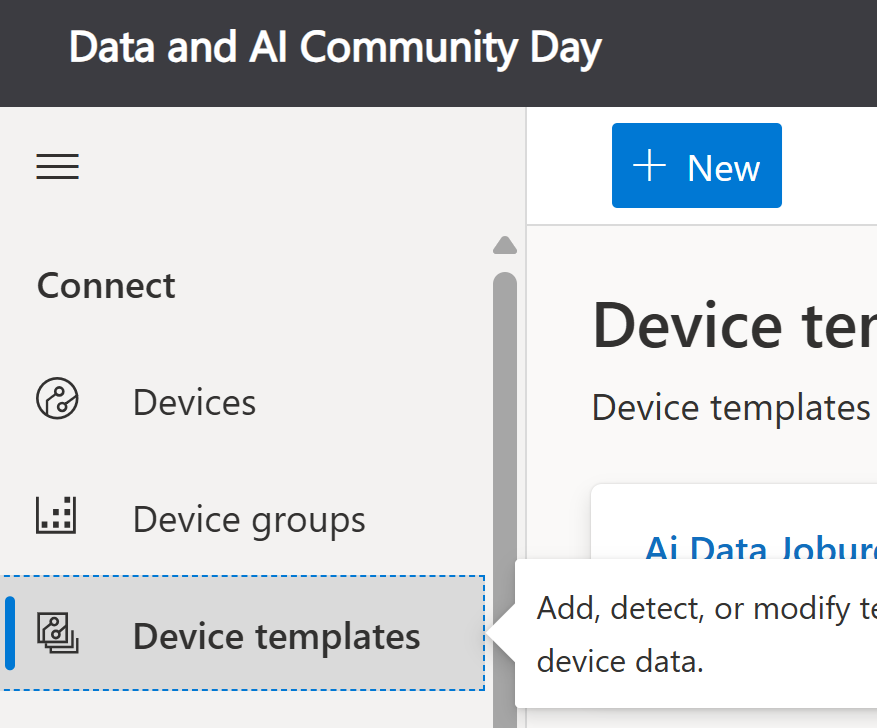

Create an IoT Device which is a cloud connected IoT Device.

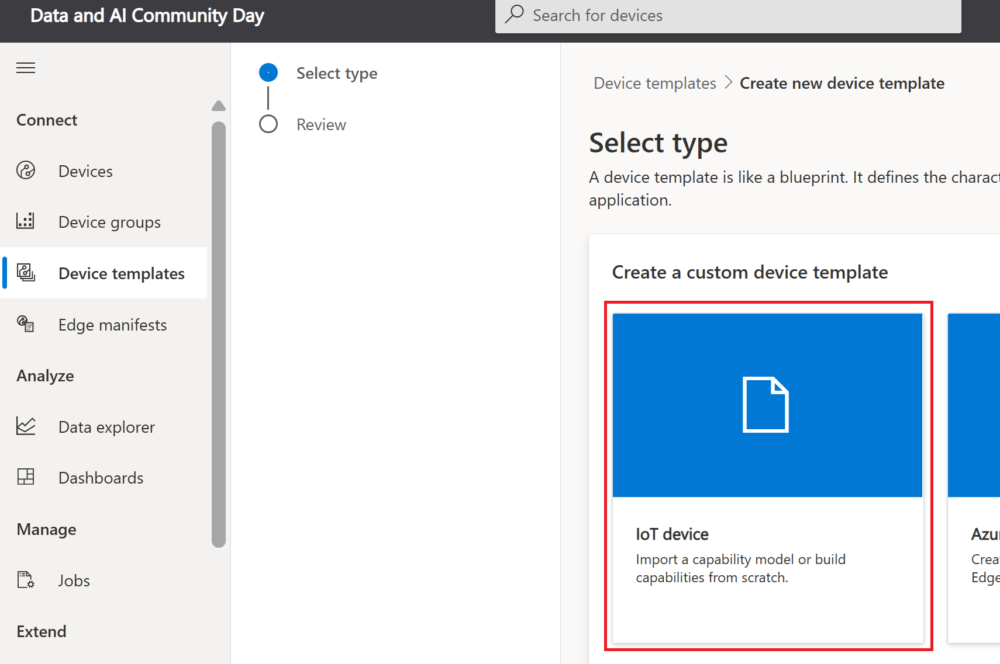

Provide a template name.

Create the Template.

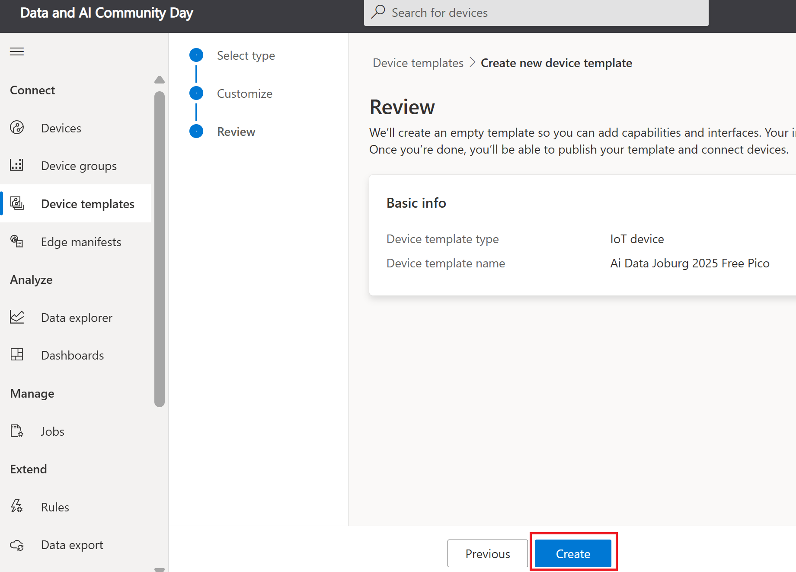

Import the provided model.  This is found in the <b>Models</b> folder within the Github repository.

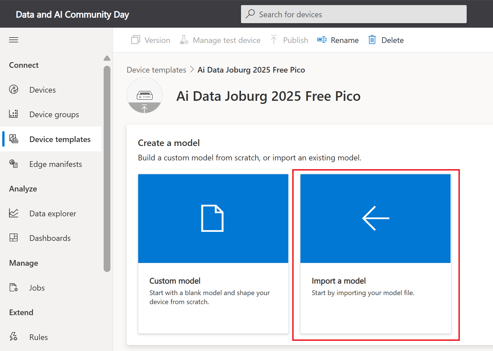

Once imported, generate template views from the model.

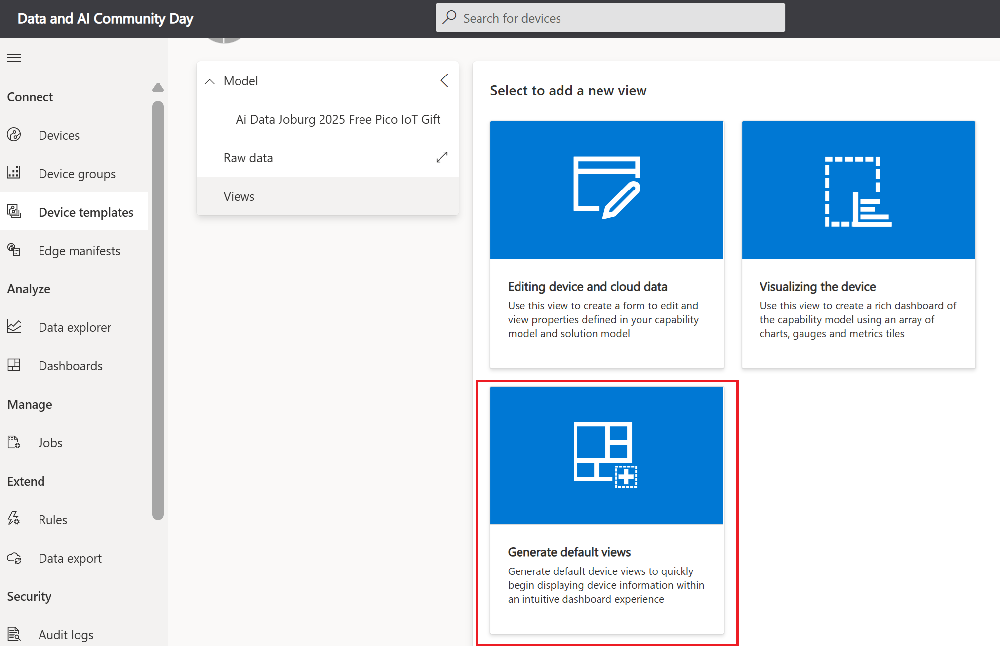

Publish the template as a versioned template.

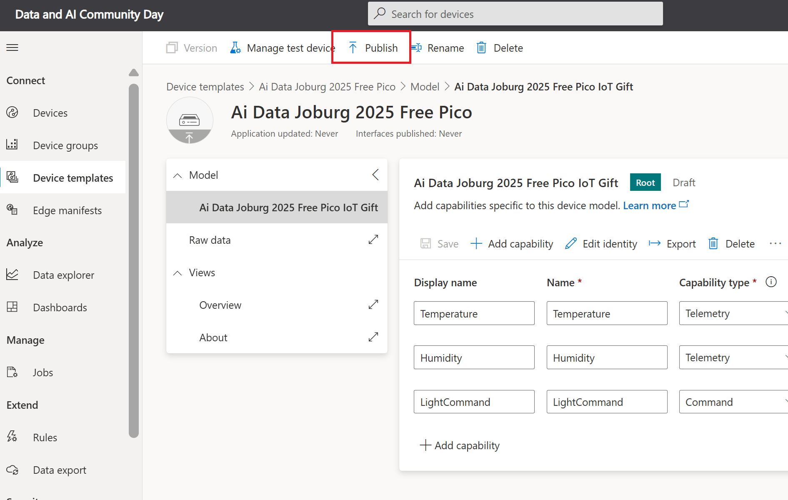

Create a new device using the created template.

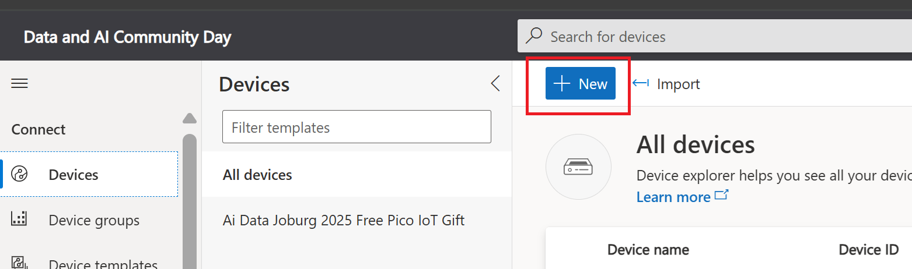

Create the new device with name and device id.   Be sure to select the previously created template.

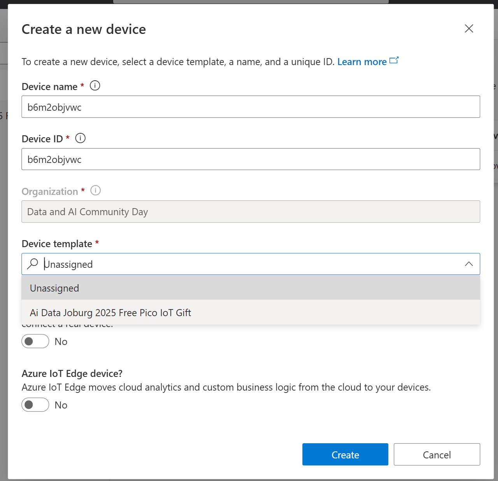

Open the Device Connection screen.

Take note of all the connection settings for using in the provided source code.

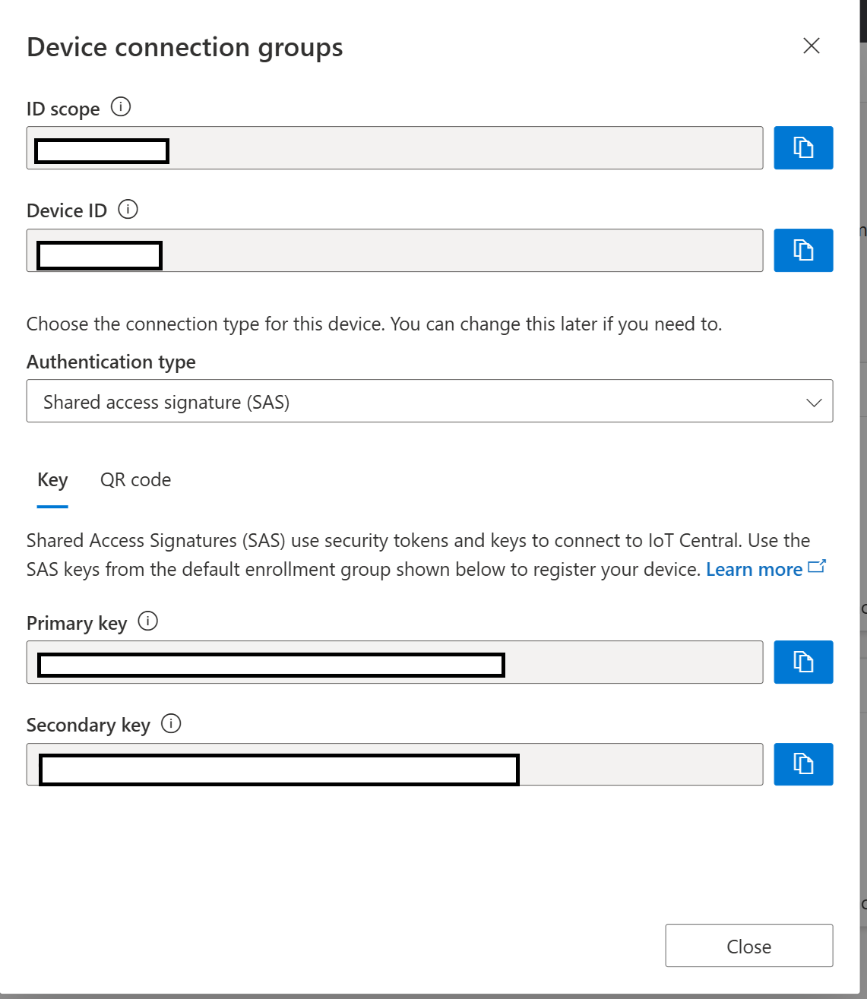

Build the cicuit on the breadboard using the provided components.

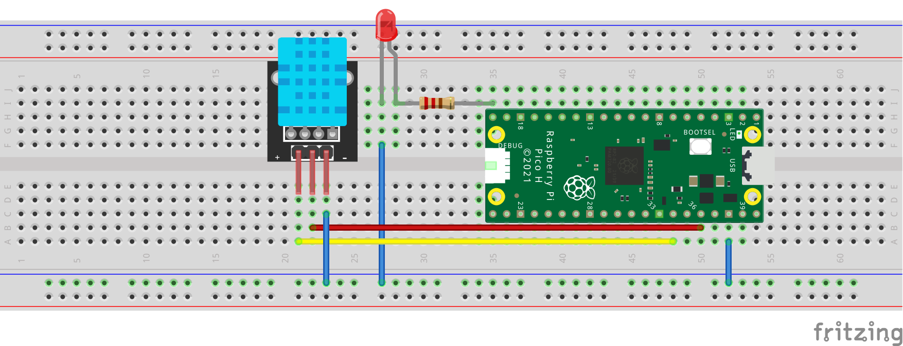

Edit the provided code.  Provide your wifi <b>SSID</b> and <b>WIFIPASSWORD</b>

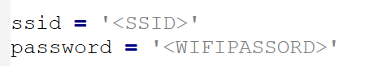

Provide the <b>SCOPEID</b>, <b>DEVICEID</b> and <b>PRIMARYKEY</b>

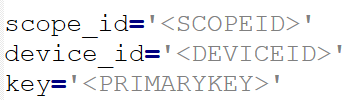

Run the application on the Pico and have FUN!

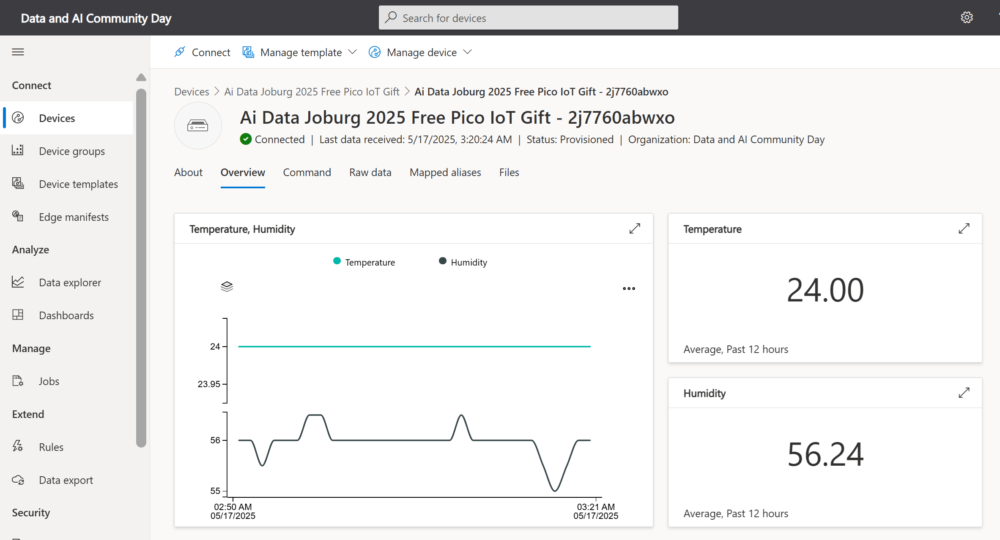